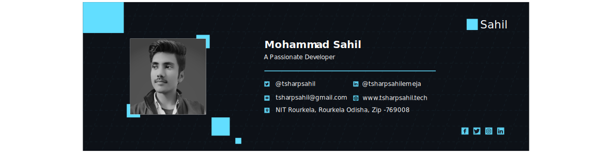

<h2 align='center'> <i>Hello, Folks! </h2>

 

 

<strong>Visitors count:</strong>

  <!-- <meta http-equiv="refresh" content="0.6"> -->

 
  

 

<strong>Languages and Tools:</strong>

 
<code></code>
<code></code>
<code></code>
<code></code>
<code></code>
<code></code>
<code></code>
<code></code>
<code></code>
<code></code>
<code></code>
<code></code>
<code></code>
<code></code>
<code></code>
<code></code>
<code></code>
<code></code>

 

<strong>Social Media Handles:</strong>

 

 
 

 
 ### Show some ❤️ by starring some of the repositories!

